# 🏰 Karunada-Kote Guide
### Karnataka Pride · Virtual Historian · Project 57

> *"Let the stones speak their stories. Walk the forts. Hear the history."*

A location-aware Android heritage tourism app that acts as a **Virtual Historian** for Karnataka's historical forts. Walk inside a fort, and the app detects your GPS position and narrates the history of each landmark in both **English and Kannada** using **Google Gemini AI**.

---

## 📱 Demo Screenshots

| Login Screen | Home / Fort Selection | Bekal Fort Map |
|---|---|---|
| 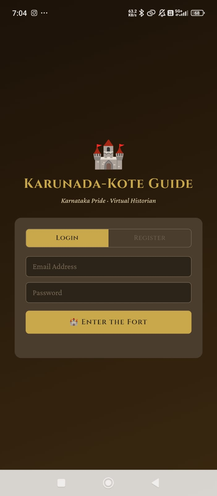 | 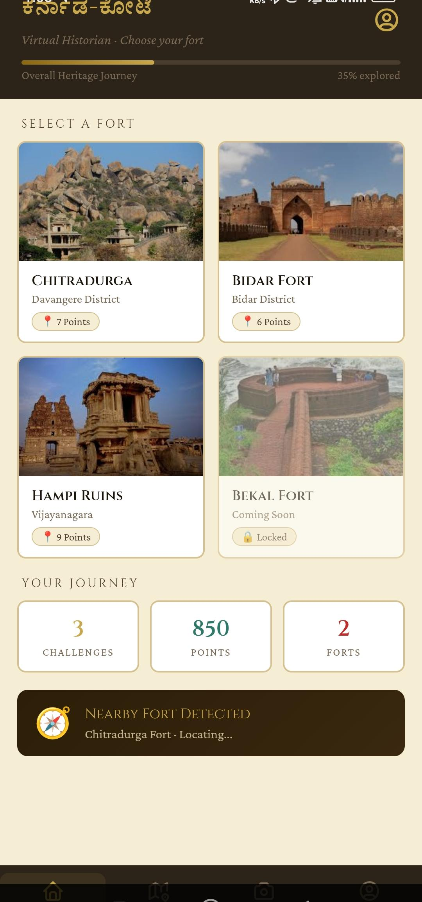 | 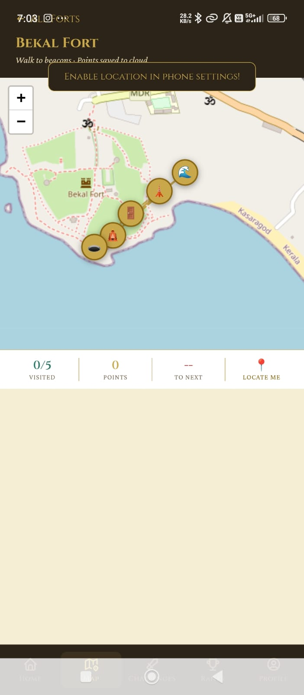 |

| Bekal Fort Inside Story | Hampi Ruins Map | Hampi Inside Story | photo challenge
|---|---|---|---|
| 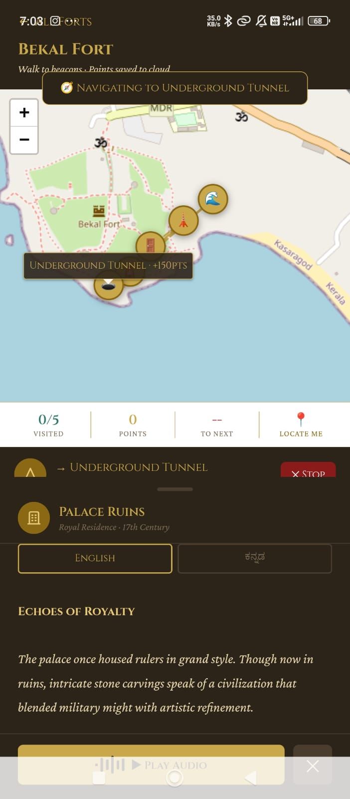 | 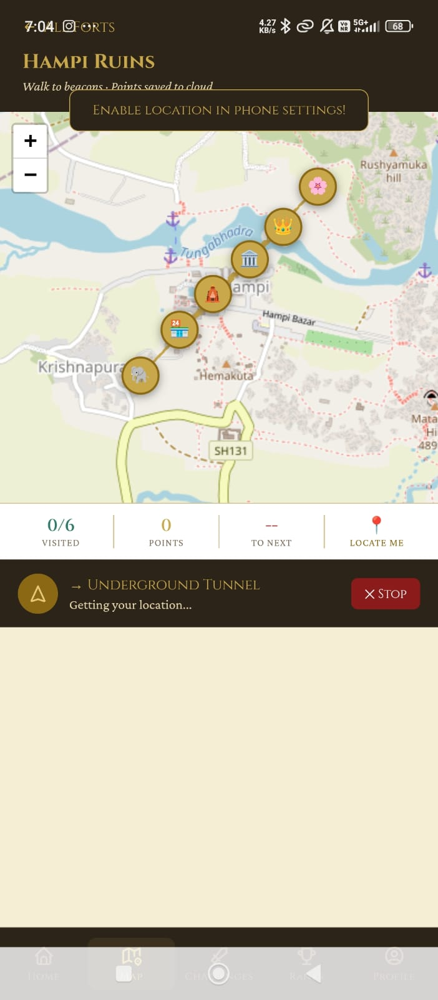 | 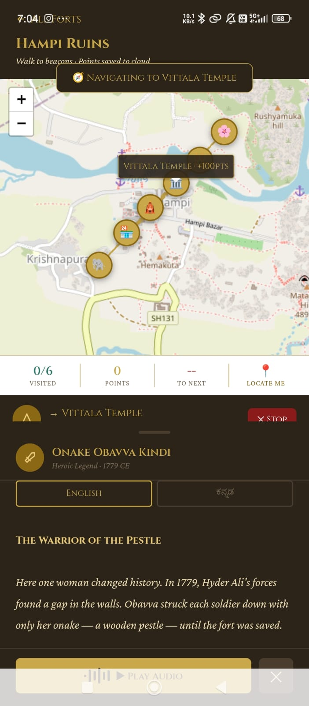 | 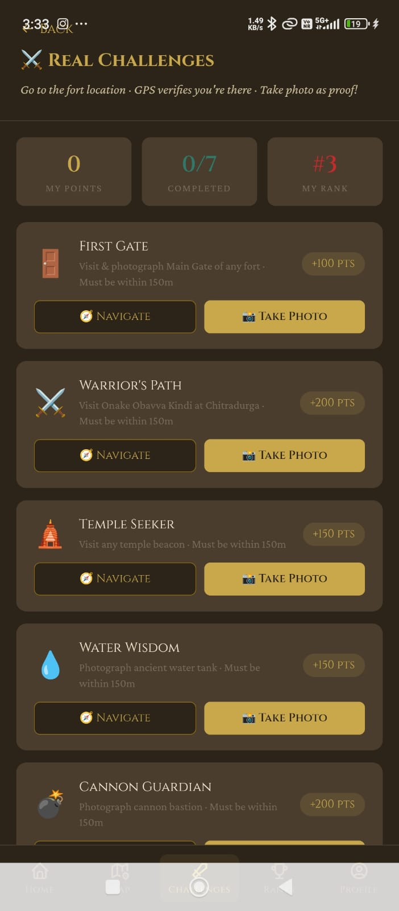 |
| Leader board |

| 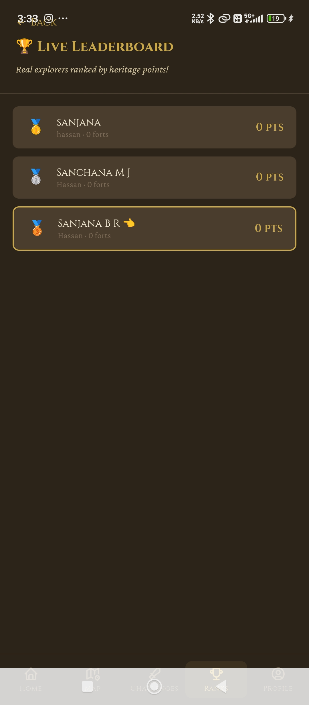

| Google Developer Profile | GDP Codelabs Page 1 | GDP Codelabs Page 2 |
|---|---|---|
| 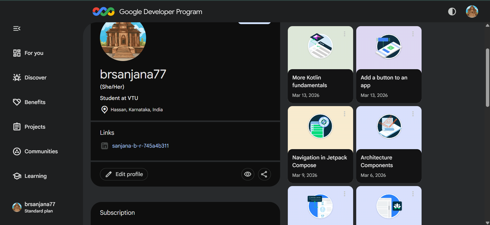 | 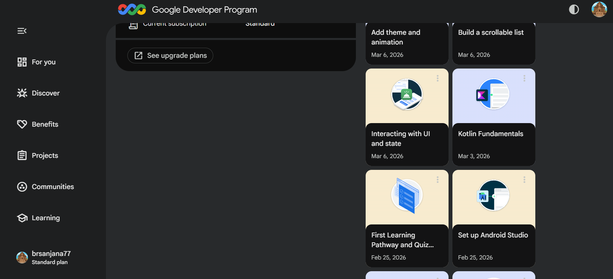 | 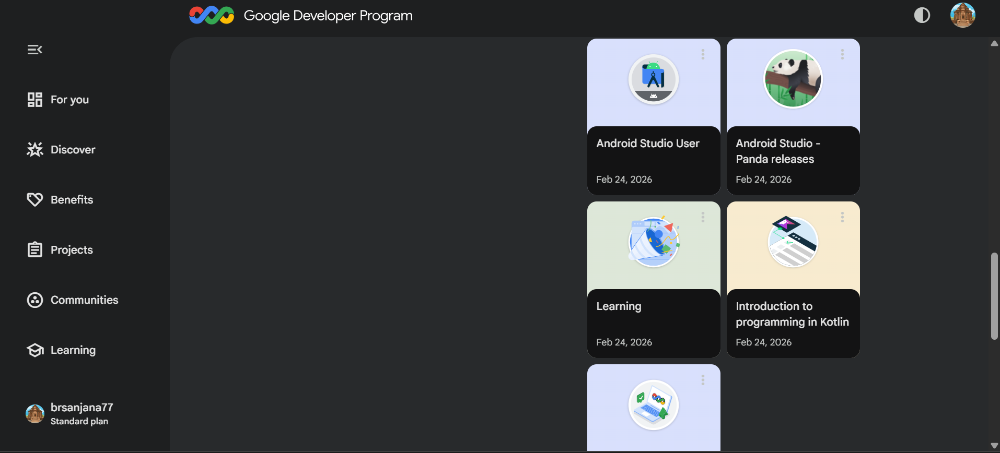 |

---

## 🎯 Problem Statement

Karnataka's magnificent historical forts — Chitradurga, Bidar, Bekal, Hampi — are visited by thousands every year. But most visitors walk through without understanding the history because:

- Professional guides are **expensive and unavailable**
- Signboards are **faded, missing, or only in English**
- No **engaging digital experience** exists for students and young visitors

---

## ✅ Features

- 📍 **GPS-Triggered Beacon Stories** — Walk within 80m of a landmark and the app automatically narrates its history
- 🗺️ **Live Interactive Maps** — Real OpenStreetMap tiles with custom fort beacon markers and walking route polylines
- 🤖 **Gemini AI Narratives** — Bilingual historical stories generated using Google Gemini API
- 🇮🇳 **Bilingual Support** — All stories available in both English and Kannada
- 🎮 **Photo Challenges** — Gamified missions that award Heritage Points for photographing fort features
- 🔐 **Login / Register** — Secure entry with localStorage-based auth
- 👤 **User Profile** — Heritage Stats (points, forts visited, stories heard, challenges completed)
- 🏰 **4 Forts Covered** — Chitradurga, Bidar, Bekal, Hampi

---

## 🛠️ Tech Stack

| Layer | Technology |
|---|---|
| Android Native | Kotlin, Android SDK 21+ |
| UI Host | Android WebView + `@JavascriptInterface` |
| GPS | `FusedLocationProviderClient` (Google Play Services) |
| Maps | Leaflet.js v1.9.4 + OpenStreetMap tiles |
| Frontend | HTML5, CSS3, Vanilla JavaScript ES6+ |
| AI Narratives | Google Gemini API |
| Data Persistence | Browser `localStorage` |
| Typography | Google Fonts — Cinzel, Crimson Pro |
| Build System | Gradle |
| Version Control | GitHub |

---

## 📁 Project Structure

```
Karunada-Kote-Guide/
│
├── app/
│   ├── src/
│   │   └── main/
│   │       ├── java/com/karnataka/koteguide/
│   │       │   └── MainActivity.kt          # Kotlin entry point, GPS bridge
│   │       ├── assets/
│   │       │   └── index.html               # Full SPA frontend (maps, stories, UI)
│   │       ├── res/
│   │       │   ├── layout/
│   │       │   │   └── activity_main.xml    # WebView layout
│   │       │   └── values/
│   │       │       ├── strings.xml
│   │       │       └── themes.xml
│   │       └── AndroidManifest.xml
│   └── build.gradle
│
├── screenshots/                             # App screenshots for README
│   ├── login.jpeg
│   ├── bekal_fort.jpeg
│   ├── bekal_fort_inside_location.jpeg
│   ├── hampi_fort.jpeg
│   ├── hampi_fort_inside_location.jpeg
│   └── gdp_profile.png
│
├── build.gradle
├── settings.gradle
├── gradle.properties
└── README.md
```

---

## ⚙️ How It Works — Architecture

```
User (Visitor at Fort)
        ↓
MainActivity.kt (Kotlin)
  - Requests ACCESS_FINE_LOCATION permission
  - FusedLocationProviderClient gets GPS fix
  - Calls evaluateJavascript("updateUserLocation(lat, lng)")
        ↓
WebView hosts index.html SPA
  - Leaflet.js renders OpenStreetMap tiles
  - Haversine formula checks distance to each beacon POI
  - If distance < 80m → show Beacon Banner → open Story Panel
  - Gemini AI bilingual narrative displayed
  - Heritage Points awarded
        ↓
localStorage
  - Saves user profile, visited POIs, earned points
```

---

## 🚀 Installation and Setup

### Prerequisites
- Android Studio (Hedgehog or later)
- Android SDK 21+
- Google Play Services on emulator/device
- Internet connection (for OSM map tiles and Gemini API)

### Steps

1. **Clone the repository**
```bash
git clone https://github.com/YOUR_USERNAME/Karunada-Kote-Guide.git
cd Karunada-Kote-Guide
```

2. **Open in Android Studio**
   - Open Android Studio
   - Click `File → Open`
   - Select the cloned project folder

3. **Add your Gemini API Key**
   - Open `app/src/main/assets/index.html`
   - Find the line: `const GEMINI_API_KEY = "YOUR_API_KEY_HERE";`
   - Replace with your key from [Google AI Studio](https://aistudio.google.com)

4. **Build the project**
```bash
./gradlew assembleDebug
```

5. **Run on device or emulator**
   - Connect an Android device with USB debugging enabled, OR
   - Start an Android Virtual Device (AVD) in Android Studio
   - Click the **Run** button (▶) in Android Studio

> **Note:** For GPS to work properly, test on a **physical Android device** rather than the emulator.

---

## 🏛️ Forts and Points of Interest

### Chitradurga Fort
| POI | GPS Coordinates | Points |
|---|---|---|
| Main Gate — Meragina Baagilu | 14.2294°N, 76.3998°E | +100 |
| Onake Obavva Kindi | 14.2310°N, 76.3975°E | +200 |
| Hidimbeshwara Temple | 14.2285°N, 76.3990°E | +150 |

### Bidar Fort
| POI | GPS Coordinates | Points |
|---|---|---|
| Main Darwaza | 17.9142°N, 77.5194°E | +100 |
| Rangin Mahal | 17.9150°N, 77.5200°E | +150 |
| Solah Khamba Mosque | 17.9138°N, 77.5188°E | +125 |

### Bekal Fort
| POI | GPS Coordinates | Points |
|---|---|---|
| Underground Tunnel | 12.3916°N, 75.0395°E | +150 |
| Palace Ruins | 12.3920°N, 75.0388°E | +125 |
| Observation Tower | 12.3910°N, 75.0400°E | +100 |

### Hampi Ruins
| POI | GPS Coordinates | Points |
|---|---|---|
| Vittala Temple | 15.3348°N, 76.4617°E | +100 |
| Virupaksha Temple | 15.3350°N, 76.4598°E | +125 |
| Hampi Bazaar | 15.3352°N, 76.4605°E | +75 |
| Onake Obavva Kindi | 15.3340°N, 76.4610°E | +200 |

---

## 🎮 Gamification System

| Badge | Points Required | Rank |
|---|---|---|
| 🥉 Bronze Explorer | 0 – 499 pts | Beginner |
| 🥈 Silver Explorer | 500 – 999 pts | Intermediate |
| 🥇 Gold Historian | 1000 – 1999 pts | Advanced |
| 🏆 Karnataka Legend | 2000+ pts | Expert |

---

## 🧪 Test Cases

| TC | Type | Description | Result |
|---|---|---|---|
| TC-01 | Unit | WebView loads index.html from assets | ✅ Pass |
| TC-02 | Unit | Location permission dialog appears | ✅ Pass |
| TC-03 | Unit | FusedLocationProviderClient returns GPS fix | ✅ Pass |
| TC-04 | Unit | evaluateJavascript() injects GPS into JS | ✅ Pass |
| TC-05 | Integration | Leaflet map renders OSM tiles | ✅ Pass |
| TC-06 | Integration | Beacon markers render with correct colours | ✅ Pass |
| TC-07 | Integration | Story Panel opens on beacon tap | ✅ Pass |
| TC-08 | Integration | Kannada Unicode renders in WebView | ✅ Pass |
| TC-09 | Integration | Haversine triggers banner within 80m | ✅ Pass |
| TC-10 | Integration | localStorage saves and reloads profile | ✅ Pass |
| TC-11 | UAT | Photo Challenge marks Done correctly | ✅ Pass |
| TC-12 | UAT | Bidar Fort centres on correct GPS coords | ✅ Pass |
| TC-13 | UAT | Bekal Fort renders 5 beacons correctly | ✅ Pass |
| TC-14 | UAT | Hampi Ruins renders 6 POIs correctly | ✅ Pass |
| TC-15 | UAT | Full flow: Splash→Login→Fort→Story→Profile | ✅ Pass |
| TC-16 | UAT | Offline OSM tile caching | ❌ Fail |

---

## 🔮 Future Enhancements

- [ ] Full offline OSM tile caching for no-internet environments
- [ ] Live Gemini API real-time narration (not pre-generated)
- [ ] Android TTS for actual spoken audio narration
- [ ] Real-time `watchPosition()` continuous GPS tracking
- [ ] Migration to full Jetpack Compose (remove WebView hybrid)
- [ ] Expand to Badami caves, Srirangapatna, Shravanabelagola
- [ ] AR overlays showing historical reconstructions on camera
- [ ] Multi-user school leaderboard for heritage field trips
- [ ] Firebase Authentication replacing localStorage auth

---

## 📚 Learning Outcomes

This project was built during a 15-week Android App Development internship at
**MindMatrix.io (CL Infotech Pvt. Ltd.), Bengaluru** as part of VTU BCS803.

Skills demonstrated:
- Kotlin + Android SDK development
- Jetpack Compose UI (mini projects)
- Room Database CRUD (TaskSync App)
- Retrofit API integration (Mars Photos App)
- WebView + `@JavascriptInterface` GPS bridge
- Leaflet.js interactive maps with OpenStreetMap
- Google Gemini API integration and prompt engineering
- Haversine GPS proximity formula implementation
- Google Developer Program — 14 codelabs completed

---

## 👩‍💻 Developer

**Sanjana B R**
- USN: 4GL23CS409
- 8th Semester, CSE
- Government Engineering College, Kushalnagar (VTU)
- Internship: MindMatrix.io | Feb – May 2026
- LinkedIn: [sanjana-b-r-745a4b311](https://www.linkedin.com/in/sanjana-b-r-745a4b311)
- Google Developer Profile: [brsanjana77](https://developers.google.com/profile/u/brsanjana77)

---

## 📄 License

This project was developed as part of the VTU Industry Internship Programme (BCS803).
© 2026 Sanjana B R. All rights reserved.

---

<p align="center">
  Made with ❤️ for Karnataka's Heritage · Karunada-Kote Guide · Project 57
</p>
